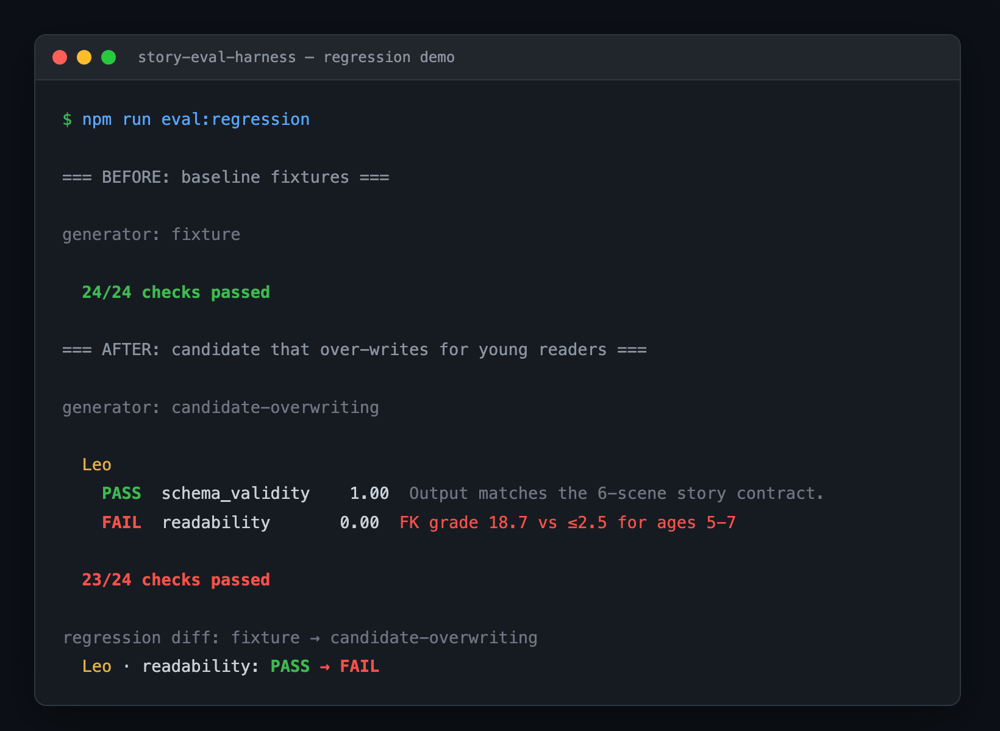

# Story Eval Harness

A **provider-agnostic evaluation harness for AI-generated children's stories.** It scores generated stories on objective dimensions and flags quality regressions **before a prompt or model change ships** — runs fully offline, with zero API keys.

> Inspired by work on [HeroKid](https://www.herokid.app), a live AI storytelling app for children. When an LLM writes free-text stories for a young audience, a quality regression (prose that drifts too advanced, output that breaks the render contract) is both unacceptable and easy to miss in a quick human skim. This harness catches those regressions automatically.



_The harness catching a regression a reviewer would likely miss: a candidate model returns grammatically perfect but far-too-advanced prose for a 6-year-old, and the readability grade jumps from −0.8 to **18.7** (college level). [Full transcript →](docs/regression-demo.md)_

## Why it's built this way

Generation sits behind a single `StoryGenerator` interface (`src/adapter.ts`). That one decision buys three things at once:

1. **Safe to publish** — the public build uses synthetic personas (`FixtureGenerator`), never real child data.
2. **Demoable** — runs offline, deterministically, with zero API keys.
3. **Model-agnostic** — point it at any model or prompt to compare runs without touching the evaluators.

## Architecture

```
 synthetic cases ──▶ StoryGenerator ──▶ StoryOutput ──▶ [ Evaluators ] ──▶ Scorecard
   (12 golden        (interface)                         schema_validity      │
    personas)            │                               readability          ├─▶ terminal table
                fixture / provider / candidate           personalization*     └─▶ regression diff
                                                         length*                  (PASS → FAIL)
                                                         banned_content*
                                                         safety (LLM-judge)*
                                                         * = roadmap, not shipped yet
```

Evaluators are deterministic by default (cheap, free, CI-friendly). The roadmap adds **one LLM-as-judge** dimension (safety) for the subtle cases a lexicon can't catch.

### The two shipped evaluators

- **`schema_validity`** — does the output match the structure the app must render (exactly 6 scenes, non-empty fields, valid types)? The cheapest, most fundamental gate: a story that fails here crashes the UI regardless of how good the prose is.
- **`readability`** — is the Flesch-Kincaid grade level appropriate for the child's age band (`5-7 ≤ 2.5`, `8-10 ≤ 5.0`, `11-12 ≤ 7.0`)? A story that reads at grade 9 is wrong for a 6-year-old no matter how safe it is.

## Run it

```bash
npm install
npm run eval            # baseline: 12 synthetic cases, 24 checks, all green
npm run eval:regression # the money shot: a candidate over-writes → readability PASS → FAIL
npm run typecheck
```

`npm run eval` prints the scorecard and exits non-zero on any scored failure (so it's ready to drop into CI). pnpm works too if you prefer it.

## Bring your own model

The fixture generator is just one implementation of `StoryGenerator`. To evaluate a real model, implement the interface against your provider's client and pass it to `run()`:

```ts
import type { StoryGenerator, StoryInput, StoryOutput } from "./src/adapter";
import { run } from "./src/run";
import { printScorecard } from "./src/scorecard";

class MyModelGenerator implements StoryGenerator {
  readonly id = "my-model";

  async generate(input: StoryInput): Promise<StoryOutput> {
    const res = await myLlm.generateStory({
      name: input.childName,
      age: input.childAge,
      template: input.adventureTemplate,
      language: input.language,
    });
    // Map the provider's response onto the harness contract:
    return { title: res.title, scenes: res.scenes, wordCount: res.wordCount };
  }
}

printScorecard(await run(new MyModelGenerator()));
```

The evaluators and scorecard never change — that's the point of the boundary. Use `diffScorecards(before, after)` to grade one model/prompt against another.

## Honesty boundary — what this is, and isn't

This is a focused demo, not a complete production system:

- **Fixture-only public version.** It scores canned synthetic stories to prove the evaluator logic. No model is called.
- **No real user data.** Every persona is invented; this repo is safe to publish for a children's product context.
- **Not yet an automatic release gate.** It's a manual, pre-ship eval command — no CI/merge blocking is wired up here.
- **Two dimensions today** — `schema_validity` and `readability`. The others below are roadmap.

## Roadmap

- More evaluators: `personalization` (child/pet names present and consistent), `length` (word count within the age band), `banned_content` (deterministic lexicon safety floor)
- One `safety` **LLM-as-judge** evaluator for subtle scary/unsafe themes a lexicon misses
- JSON artifact output + before/after diff wired into the CLI
- Validate the LLM judge against a human-labeled set (evals-of-evals)
- A CI gate that blocks merges on a safety regression
- Multilingual readability (the FK evaluator is English-only today and `skip`s other languages)

## License

MIT
